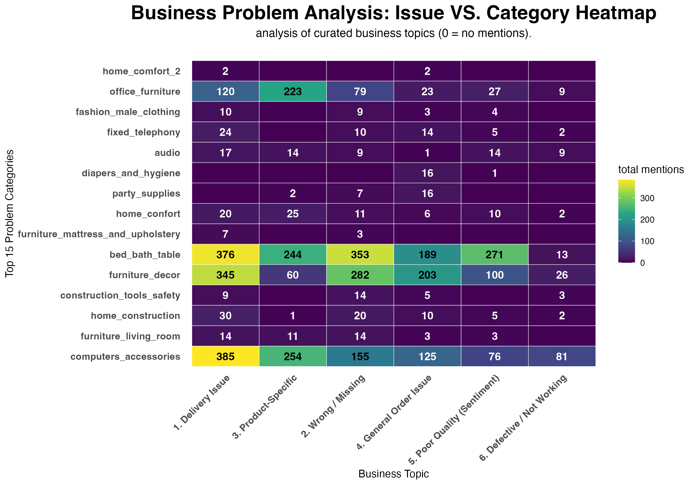

# Business Analysis Report: Olist E-Commerce Platform

### Project Goal: Diagnosing the Root Causes of Poor Customer Reviews

This project is a comprehensive business analysis of the Olist e-commerce platform, Brazil's largest. The goal was to move beyond simple descriptions of "bad reviews" and use a data-driven approach to identify, quantify, and diagnose the specific, actionable root causes of customer dissatisfaction.

---

## Key Findings

This analysis identified five core drivers of poor customer satisfaction:

1.  **Logistics Tipping Point:** A **23-day** delivery wait time was identified as the critical threshold. Once this limit is exceeded, customer satisfaction scores drop sharply.

2.  **Product Presentation:** Products with **only one photo** account for **over 50% of all bad reviews**. In contrast, products with **5 or more photos** significantly mitigate this risk.

3.  **Freight Perception Threshold:** A freight-to-price ratio of **39%** is the key "tipping point." Bad review rates rise significantly once this threshold is crossed.

4.  **Specific Root Causes (Heatmap):** The text-mining heatmap successfully pinpointed the root causes for high-risk categories.
    * `computers_accessories` complaints are driven by **`cartucho` (cartridge)** defects.
    * `office_furniture` complaints are driven by **`cadeira` (chair)** defects.

5.  **"Data Silence" Insight:** The heatmap revealed that customers in "empty cell" categories (like `home_comfort_2`) are providing "silent bad reviews" (NA comments), meaning text analysis alone is insufficient to diagnose their problems.

---

## Actionable Recommendations

Based on these findings, the following short-term and long-term actions are recommended:

### Short-Term (High-Impact)
1.  **(High-Priority) Review Specific SKUs:** Immediately investigate suppliers for **`cartucho` (cartridge)** and conduct urgent quality assessments on **`cadeira` (chair)** SKUs.
2.  **Mandate 5-Photo Minimum:** Implement a platform-wide rule change requiring a **minimum of 5 photos** for all product listings.
3.  **Deploy Active Surveys:** Launch a targeted survey campaign for "Data Silence" categories (like `home_comfort_2`) to discover the true drivers of their dissatisfaction.

### Long-Term (Strategic)
1.  **Optimize Logistics Network:** Re-engineer the fulfillment network to reduce average delivery time to **under the 23-day threshold**.
2.  **Calibrate Freight Pricing:** Optimize the freight pricing model to keep the freight-to-price ratio **below the 39% perception threshold**.

---

## Core Analysis: Root Cause Heatmap

The centerpiece of this analysis was the "Problem vs. Category Heatmap." This chart successfully diagnosed the *specific* root causes for each high-risk category, moving beyond generic complaints.

---

## Tools & Skills

* **Data Preparation & Extraction:** SQL (View the project's [SQL Scripts](/sql_scripts/))
* **Data Manipulation & Analysis:** R, dplyr, tidyverse
* **Data Visualization:** ggplot2
* **Text Mining:** tidytext (Bottom-Up Tokenization)
* **Reporting:** R Markdown

---

> ## [Click here for the full Detailed Analysis Report (report.html)](report.html)

